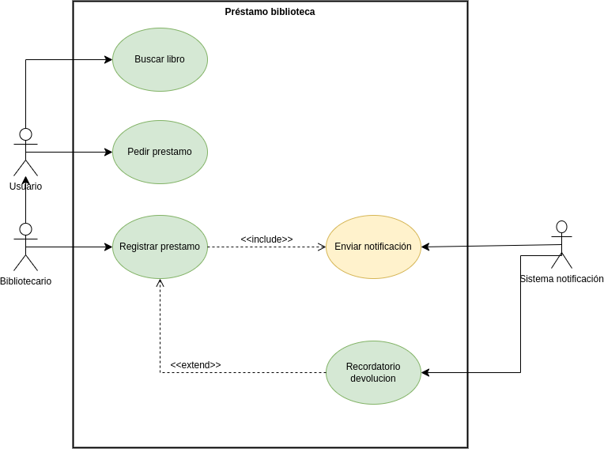

# Proyecto biblioteca.

## Diagrama de casos de uso de la biblioteca.

## Especificación de casos de uso de la biblioteca.

### Actores

#### Usuario

|  Actor | Usuario |
|---|---|
| Descripción  | Usario común de la biblioteca. |
| Características  ||
| Relaciones | Registrar prestamo. |
| Referencias | Buscar libro y pedir prestamo. |   
|  Notas ||
| Autor  | Alexander Faustino |
|Fecha | 29/10/2024 |

|  Atributo |||
|---|---|---|
| _Nombre_  | _Descripción_  | _Tipo_ |
| | |

#### Bibliotecario

|  Actor | Bibliotecario |
|---|---|
| Descripción  | Bibliotecario de la bibloteca. |
| Características  | El bibliotecario realiza las mimas acciones que el Usuario y las acciones especifícas. |
| Relaciones | Registrar prestamo. |
| Referencias | Buscar libro, pedir prestamo y registrar prestamo. |   
|  Notas ||
| Autor  | Alexander Faustino |
|Fecha | 29/10/2024 |

|  Atributo |||
|---|---|---|
| _Nombre_  | _Descripción_  | _Tipo_ |
| | |

#### Sistema Notificación

|  Actor | Sistema Notificación |
|---|---|
| Descripción  ||
| Características  ||
| Relaciones ||
| Referencias | Enviar notificación y recordar la devolución. |   
|  Notas ||
| Autor  | Alexander Faustino |
|Fecha | 29/10/2024 |

|  Atributo |||
|---|---|---|
| _Nombre_  | _Descripción_  | _Tipo_ |
| | |

### Casos de uso

#### Buscar libro

|  Caso de Uso	CU.1 | Buscar libro  |
  |---|---|
  | Fuentes  | Este caso de uso se sustenta gracias al documento [documento](). |
  | Actor  |  Usuario y bibliotecario.|
  | Descripción |  |
  | Flujo básico | _Descripción paso a paso de la ejecución. (1->2->3.)_ |
  | Pre-condiciones | _Que debe ocurrir con anterioridad_  |  
  | Post-condiciones  | _Que debe ocurrir con posterioridad_  |  
  |  Requerimientos | _Que debe de exister para que el caso de uso se ejecute. Ej: Tarjeta de crédito_  |
  |  Notas |  _Notas adicionales_ |
  | Autor  | _Quien desarrolla la especificación del actor_ |
  |Fecha | _Fecha de la especificación_ |